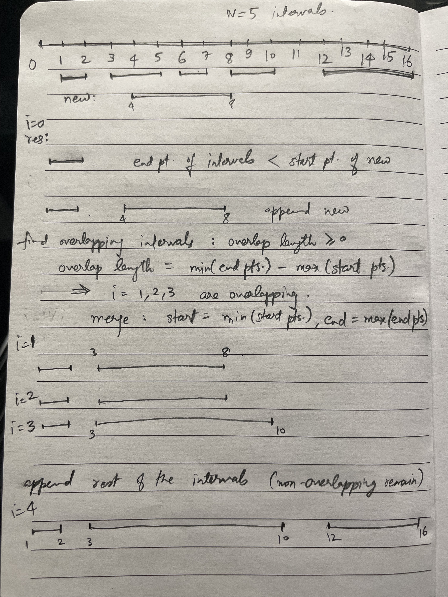

last attempt: `10/25/2023`

**Append, Merge, Append**
- Resulting array is `res`. Objective is to insert `newInterval` into a list of `intervals`. 
- Iterate with `while` loops but with a single pass through the length of the `intervals` array, in three steps:
  - Step 1: Append to `res` all elements whose starting points are less than the ending point of `newInterval`. Then append `newInterval` to `res`. 
  - Step 2a: Check if subsequent elements overlap with `newInterval`:
    - Calculate overlap length, 
    - Check if overlap length is positive. 
  - Step 2b: If overlap occurs, merge the last element of `res` to the current iteration element in `intervals`. 
  - Step 3: Append to `res` rest of the elements (these will be the non-overlapping elements to the right of `newInterval`). 
- Time Complexity: $O(n)$. 
- Space Complexity: $O(1)$. 

---

**Neetcode Solution (Better)**
- *Intuition*: Iterate over all intervals and keep updating `newInterval`. Check for non-overlap conditions first, and then check for overlap and fuse. 
- If `newInterval` is strictly to the left of `currInterval`, then concat `newInterval` with the rest of the intervals to the right, and return. 
- If `newInterval` is strictly to the right of `currInterval`, then append `currInterval` to result. This is in a loop so it will keep appending intervals to result as long as `newInterval` is to the right. 
- Only remaining condition is when `newInterval` and `currInterval` overlap: fuse the intervals as `newInterval`. 
- At the end of the for-loop, in case `newInterval` is the last interval, then with the above conditions we will never return it. Hence, append `newInterval` to result and return.  
- Time Complexity: $O(n)$. 
- Space Complexity: $O(1)$. 

---
