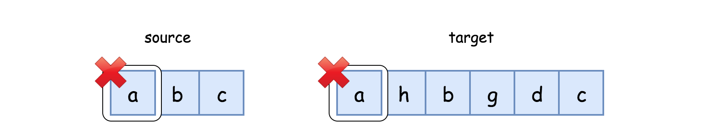
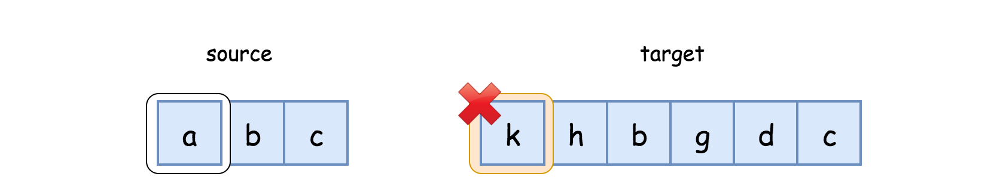

last attempt: `10/15/2023`

**Greedy Divide and Conquer**
- *Intuition*: Reduce the problem to subproblems recursively until the problem becomes small enough to tackle with. 
- When comparing only the first characters:
  - Case 1: Match found. Cross out the first characters from both strings, and continue. 
    - `isSubs(source, target) = isSubs(source[1:], target[1:])`
  - 
  - Case 2: No Match. Cross out the first character from target, and continue with the same character from source. 
    - `isSubs(source, target) = isSubs(source, target[1:])`
  - 
- Base (exit) cases:
  - `source` is empty: Hence its a substring of `target`. 
  - `target` is empty and `source` not empty: Not a substring of `target`. 
- Time Complexity: $O(m)$, where $m$ is the length of `target`. 
- Space Complexity: $O(m)$: Due to recursion call stack. 

---

**Two Pointers**
- Same intuition as above. 
- First pointer will iterate over the `target` with a for-loop. Second pointer for `source` is initialized to 0. 
- Check match conditions and increment second pointer accordingly. 
- Take care of edge cases. 
- Time Complexity: $O(m)$. 
- Space Complexity: $O(1)$. 

---

**Greedy with Hashmap**
- In case the method is called with repeated different `source` strings with `target` as constant:
  - Since the time complexity is $O(m)$ we would need to scan `target` repeatedly even though it is constant. 
- We can create a hash map out of `target` so that lookup is constant time. 
  - Keys to the map will be the unique characters in `target`, 
  - Values will be their indices in `target`. 
- We can then: 
  - Iterate over `source`, 
  - Identify the matched key in `target`, and
  - Find the index in the corresponding value such that the index is the next greatest from the `source` index.
    - We can use linear or binary search for this. 
- Time Complexity: $O(m) + O(n\log m)$ with binary search: 
  - Hash map is only built once hence the complexity with repeated method calls is $O(m\log n)$. 
- Space Complexity: $O(m)$: To build the hash map. 
