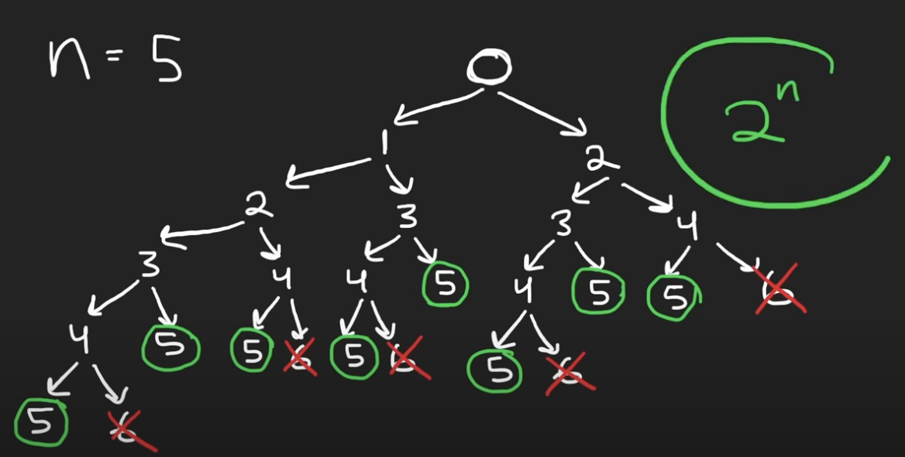
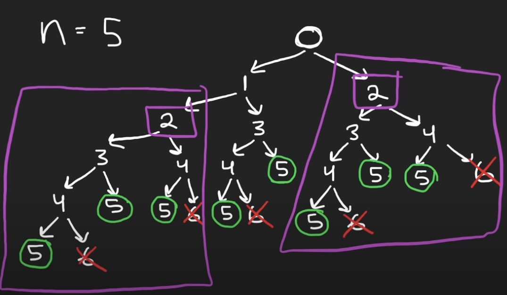
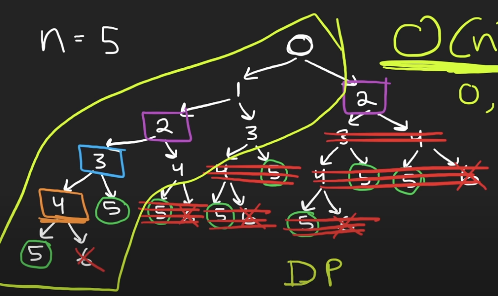
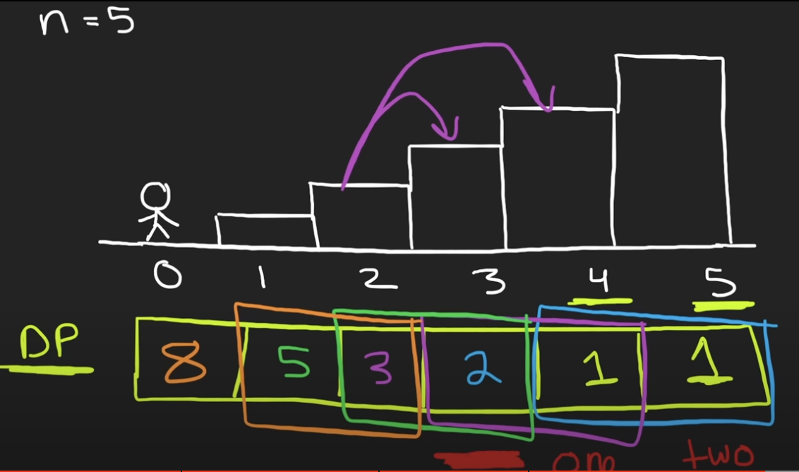

last attempt: `10/15/2023`

**Binary Tree**
- [NeetCode](https://www.youtube.com/watch?v=Y0lT9Fck7qI)
- For $n=5$, create a binary tree:

- Can find the base case with *depth-first search*:
  - Height of the tree is $n$. 
  - Time Complexity: $O(2^n)$. Extremely slow. 

---

**Dynamic Programming**
- In the above tree, there are lots of repetitions (subproblems) which can be used to reduce computations:

- Tree intuition:
  - Starting at 0 (tree top), the solution depends on subproblem starting at 1. 
  - At 1, the solution depends on subproblem starting at 2. 
  - ...
- Draw out the stairs for $n=5$. Stairs intuition:
  - Starting at stair 4 or 5, we need 1 step to reach the top. 
  - At 3, we can take 1 step or 2 steps. Hence, at 3, the solution would be number of steps starting from 4 and 5.  
  - Hence, at $x$, the solution would be the number of steps starting from ($x-1$) and ($x-2$). 
  - This results in a *Fibonacci series* starting from 1, 1. 

  

- Solution:
  - Initialize variables `one` and `two` as 1 (representing the number of steps needed to take to reach the top). 
  - Loop starting from 0 and $n-1$, and:
    - Shift `two` one place to the left so that it taked the value that `one` had, 
    - Shift `one` one place to the left so that it is the sum of the previous elements, i.e. `one` and `two`. 
    - Return `one` as it reaches the $0^{th}$ position. 
  - Time Complexity: $O(n)$. 
  - Space Complexity: $O(1)$. 
- There also exists a [closed-form solution](https://en.wikipedia.org/wiki/Fibonacci_number) for the $n^{th}$ *Fibonacci* number. 
  - Time Complexity: $O(log\space n)$: Taking a power. 
  - Space Complexity: $O(1)$. 
$$F_n = (\psi^{n+1} - \phi^{n+1})/\sqrt{5}$$
$$\psi = (1+\sqrt{5})/2, \space\space\phi = (1-\sqrt{5})/2$$ 