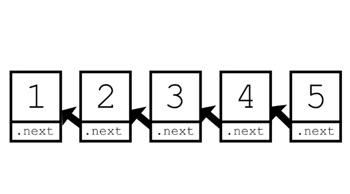

**Brute Force**
- Iterate over linked list and create an array list. 
- Reverse the array. 
- Create a new linked list from the array. 
- Time Complexity: $O(n)$. 
- Space Complexity: $O(n)$. 

---

**In-Place Iterative**
- *Intuition*:
  - We have to iterate forward in the linked list. 
  - But we have to change the `next` pointers to the previous node. 
- At every iteration, keep track of the next and previous nodes. 
- Change the pointer to previous node. 
- Time Complexity: $O(n)$. 
- Space Complexity: $O(1)$. 

