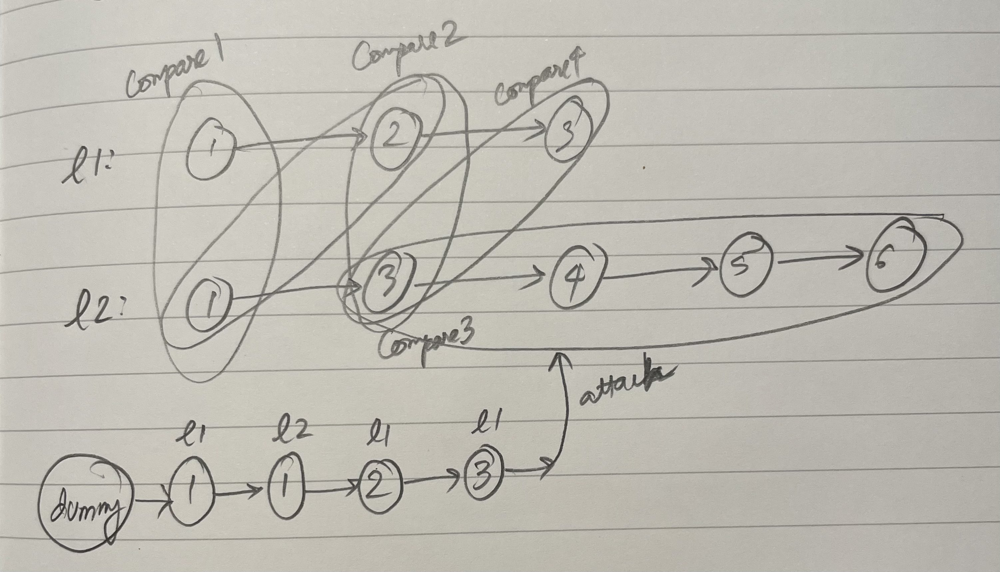

**Iteration**
- General idea is to:
  - Create a `dummy` node, where we will append all subsequent nodes for the merged sorted list, 
  - Scan the list horizontally to keep attaching nodes to the `dummy` node, 
  - Keep track of the `tail` of the new list (starting from the `dummy` node), 
  - Return the pointer to the `next` of the `dummy` node. 
- The above will only work if both lists are non-empty during all iterations. 
  - When one of the list is empty during iteration, then simply attach the rest of the non-empty list to the `tail`. 
- Time Complexity: $O(n)$, where $n$ is the sum of the legths of the two lists. 
- Space Complexity: $O(1)$. 

