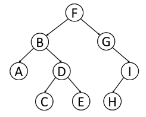

## Traversal
- *DFS*

|                |                   |                   |               |
|:--------------:|:-----------------:|:-----------------:|:-------------:|
| **Pre-Order**  | Root -->          | Left Subtree -->  | Right Subtree |
| **In-Order**   | Left Subtree -->  | Root -->          | Right Subtree |
| **Post-Order** | Left Subtree -->  | Right Subtree --> | Root          |

- *BFS*
  - Level-Order: Scan left to right for each depth level. 

## [Practice](https://leetcode.com/explore/learn/card/data-structure-tree/134/traverse-a-tree/992/)

## Solutions
- *Top-Down Approach*
  - PreOrder traversal where we call the recursive function first for the node, and then its children. 
- *Bottom-Up Approach*
  - PostOrder traversal where we call the recursive function first for the children (starting with leaf), and then parent. 