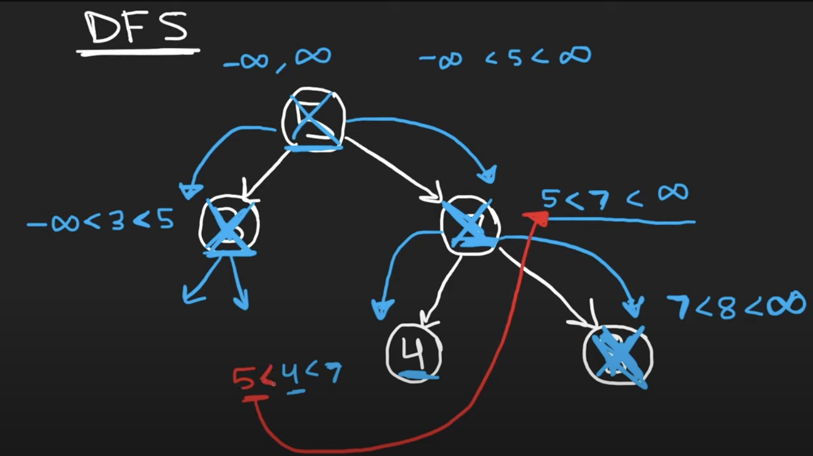

last attempt: `10/16/2023`

**Recursion**
- *Requirement*: **all** nodes in the left sub-tree should have values less than the current node, and **all** nodes in the right sub-tree should have values more than the current node. 
- *Intuition*: One should keep both upper and lower limits for each node while traversing the tree, and compare the node value not with children values but with these limits.
- When traversing the tree from `root`, in recursive call, we can compare each node with a range (min, max), such that:
  - min is updated to the parent node value if node is part of the right sub-tree. 
  - max is updated to the parent node value if node is part of the left sub-tree. 
  - (min, max) is initialized for the `root` node with $-\infty, \infty$. 
- Time Complexity: $O(n)$. 
- Space Complexity: $O(n)$. 

