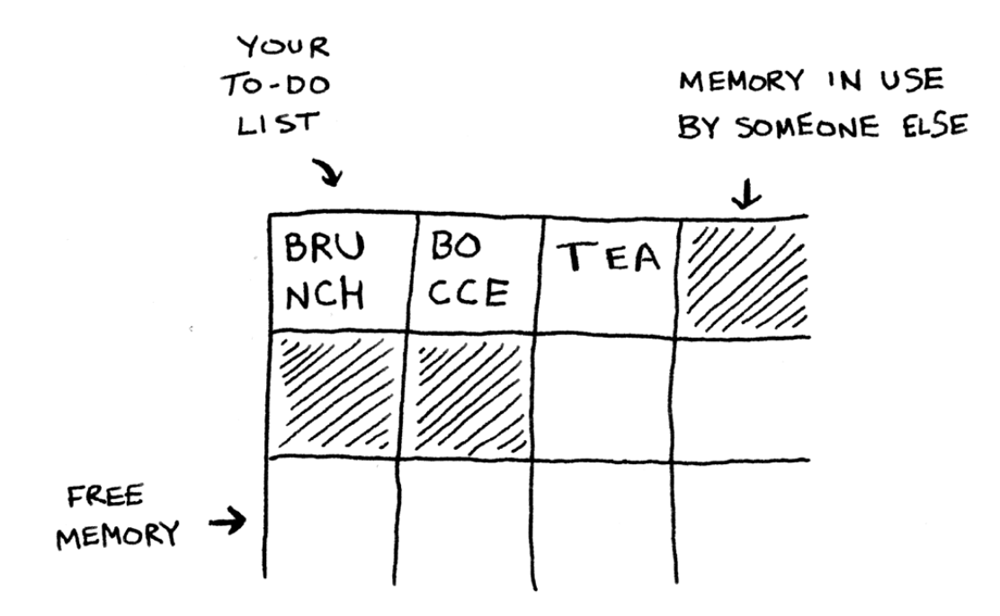
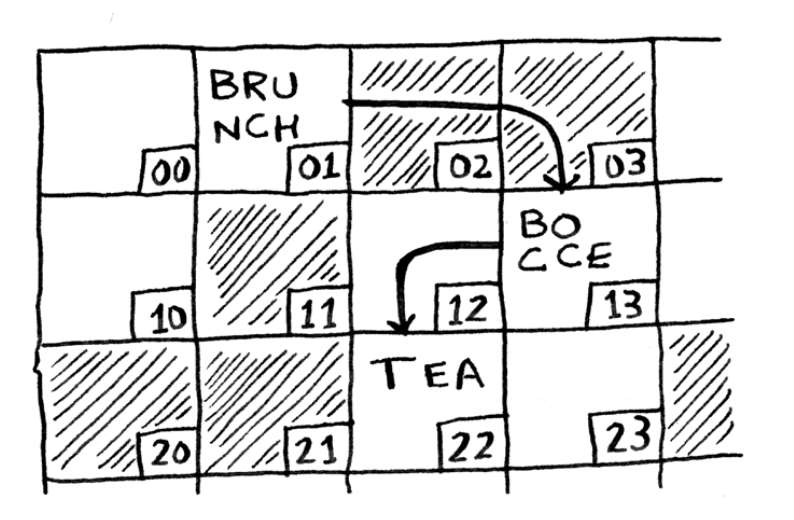
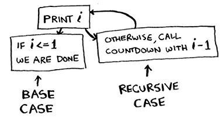
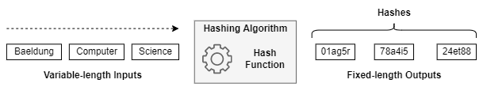
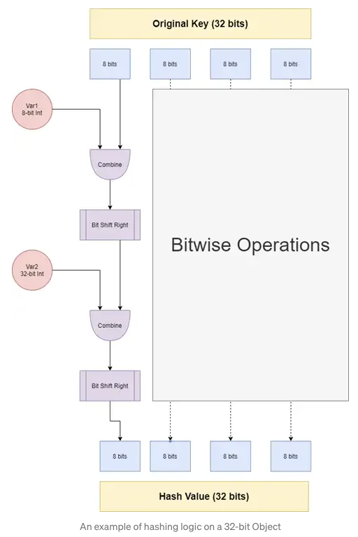
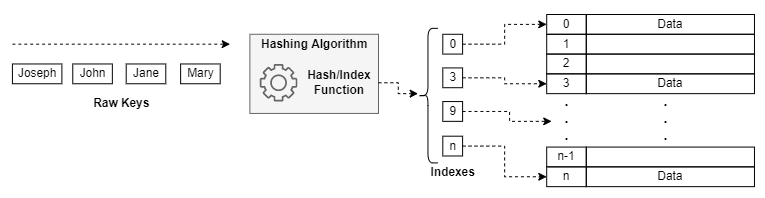
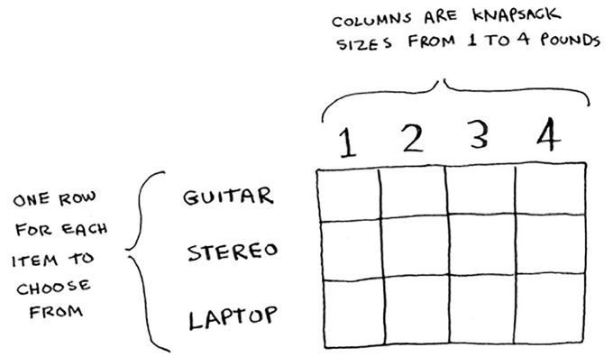
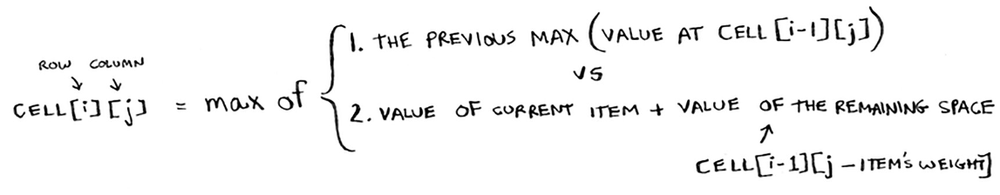

**Binary Search**:
- Input is a sorted list
- Output is either Null or position of element in list
- Complexity: $O(log \space n)$
- Intuition: *Given the middle number, and eliminates half the remaining numbers every time.* 

---

**Arrays vs. Linked Lists**:
- Arrays: 
	- Intuition: 
	- 
	
		- Allows random access
		- Complexity: $O(1)$ for reading, $O(n)$ for insertion, deletion. 
- Linked Lists: 
	- Intuition:
	- 
	
		- Allows sequential access only
		- Complexity: $O(n)$ for reading, $O(1)$ for insertion, deletion. 

---

**Selection Sort**:
- Complexity: $O(n^2)$ 
- Loop over all list elements, and each time pick the smallest of the remaining list. 

---

**Recursion**:
- Two cases:
	- *Base Case*: When function doesn't call itself to avoid infinite loop. 
	- *Recursive Case*: When function calls itself
	- 
- Recursion uses a *Call Stack* to keep track of recursions. 

---

**Quicksort**:
- *Divide & Conquer*: Recursive technique (not an algorithm):
	1. Figure out a simple case as the base case (exit strategy for recursion), 
	2. Figure out how to reduce your problem and get to the base case. 
- Steps:
	- Base case is if the input array is of length less than 2, 
	- Recursive case:
		- Pick a pivot: first array element, 
		- Loop over rest of array, and select elements less than pivot, 
		- Loop over rest of array, and select elements greater than pivot, 
		- Qsort(array) := Qsort(less_pivot) + [pivot] + Qsort(greater_pivot)
- Complexity: $O(n\log n)$ average case, $O(n^2)$ worst case. 
	- Qsort hits average case much more frequently than the worst case.
- Always choose a random element as pivot to get the average case. 
- Quicksort is faster than Mergesort because of the Big O constant. 

---

**Hash Tables**:
- Created by combining *hash functions* and *arrays*, resulting in key-value pairs (`dict` in python). 
- Hash Function:
	- Maps a variable length value to a fixed length value ([Reference](https://www.baeldung.com/cs/hash-tables)).
	- 
	- Example: SHA256 algorithm. 
	- Uses bit-wise operations, hence can be used on inputs with any datatype (example below: [*MurmerHash*](https://medium.com/nerd-for-tech/the-magic-of-hash-tables-a-quick-deep-dive-into-o-1-1295199fcd05)).
		- 
- Hash Table Working Intuition:
	- Given data (e.g. list of string/int values), create a Hash table as follows:
		- Apply hash function to each element (key), 
		- Use the output of the hash function (value) as the memory address for storing the key. 
		- 
		- At the memory address, data is usually stored in a *Linked List* to avoid overwrites in case of *Collisions*. 
- Use Cases:
	- Lookups, 
	- Preventing duplicate entries, 
	- (Web-server) Caching. 
- Complexity: 
	- $O(1)$ average case for search, insert, delete. 
	- $O(n)$ worst-case for search, insert, delete (all values in the hash table have collided at the same location). 
- Collisions:
	- Happens when the hashing function output (memory address for key) has been used before, and hence is not unique. 
	- In this case, the collided key can be appended to the existing data using a Linked List. 
		- That would mean in case of a lookup for an element which is in this Linked List, we will have to search over the Linked List which has complexity $O(n)$. 
	- Other techniques to avoid collisions:
		- *Linear Probing* (Open addressing): Finds the first following index to the determined one that has a free memory bucket to insert the daya, 
		- *Resize and Copy*: Resizes the hash table and redistributes the data on it in case of a collision. 
	- How to avoid collisions:
		- *Load Factor*: 
			- Calculation: $\frac{\text{number of items in hash table}}{\text{total number of slots}}$ 
			- Rule of thumb for Resizing: When load factor is > 0.7. 
		- *Good Hash Function*:
			- Distributes data uniformly within the available memory. 
- Cases when other DSs might be better than Hash Tables ([Reference](https://stackoverflow.com/questions/20170244/why-not-use-hashing-hash-tables-for-everything)):
	- High memory consumption, 
	- Certain operations such as iterating over all the elements whose keys are within a certain range, finding the element with the largest/smallest key, etc. - Hash tables are not sorted, and are not FIFO/LIFO. 
	- Finding a good hash function to get $O(1)$ average performance is difficult. 
- [Hash tables serve as an example of space-time tradeoff](https://en.wikipedia.org/wiki/Hash_table). 

---

**Greedy Algorithms**:
- At each step, pick the locally optimal solution. 
- *Knapsack Problem*: Steal all items in a bag that can hold 35 lbs. 
	- *Greedy Solution*: Steal the most expensive items first, and so on..
	- Does not give the optimal solution for items: 
		- Stereo, $3000, 30 lbs, 
		- Laptop, $2000, 20 lbs, 
		- Guitar, $1500, 15 lbs
	- Gives a solution that is 'close enough'. 
- *Set-Covering Problem*: 
	- Complexity Exact Algorithm: $O(n!)$
	- Complexity Greedy Algorithm: $O(n^2)$
	- Greedy Steps:
		- Find the station (set) that covers the most elements (cities) that have not been covered yet, 
		- Repeat until all required elements are covered. 
- Breadth-First Search and Dijkstra's Algorithm are both Greedy algorithms (solves for local optimums). 
- Is a good approach to approximate NP-complete problems
	- NP-Complete identification: 
		- When iterating over all combinations is required, 
		- Problem does not scale well, 
		- When breaking down the problem into sub-problems is not possible, 
		- Problem involves a set and is hard to solve, 
		- Try re-stating the problem as the Traveling salesman problem or the set-covering problem -> NP-complete. 

---

**Dynamic Programming**:
- Break hard problems into small subproblems, and solving those subproblems first.  
- Every DP solution can be represented as a grid. 
	- The values in the cells are what we are trying to optimize. 
	- Each cell is a subproblem - this can be used to figure out what are the axes. 
	- There's no single formula for calculating a DP solution (i.e. formula for calculating values in cells). 
- Knapsack Problem (alt: Travel Itinerary Problem):
- 
- 
- Items cannot be expressed as fractions in DP. 
- DP cannot handle item dependency. 
- DP is useful when we are trying to optimize something given a constraint. 

---