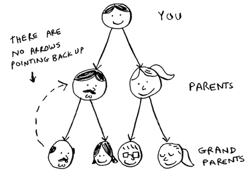
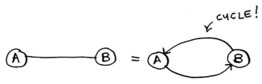
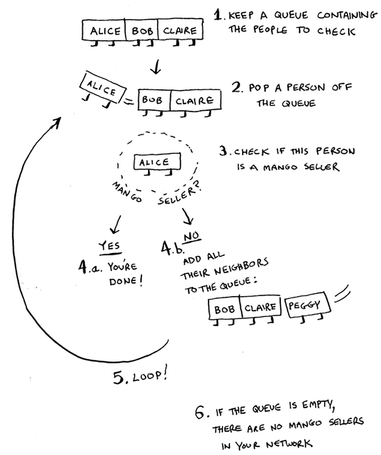

**Create Graph**
- Use hash tables to create graph structures from data, e.g.
	- `graph = {}`
	- `graph['you'] = ['alice', 'bob', 'claire']`
	- `graph['bob'] = ['anuj', 'peggy']`
	- `graph['peggy'] = []`
- Use LIFO (Stacks) or FIFO (Queues) approach
	- `from collections import deque`
- A Tree is a special kind of Graph, where no edges ever point back
- 
- Undirected edges constitute a cycle
- 

---

**Bread-First Search**
- Input is a (unweighted, directed) Graph
- Output is path feasibility, and the shortest path
- First search all 1st degree connections, then search 2nd degree connections. 
	- Queue all first degree connections and loop, 
	- Queue all second degree connections for each first degree connection in FIFO. 
	- ![[bfs.png|500]]
	- 
- Make sure the algorithm does not fall into an infinite loop - keep a list of elements already searched
- Complexity: $O(V+E)$
	- $V$ := number of vertices, 
	- $E$ := number of edges

---

**Dijkstra's Algorithm**:
- Input is a (weighted, directed) Graph
- Does not work for a graph with negative weights
- `Marking as out of scope for now` 

---