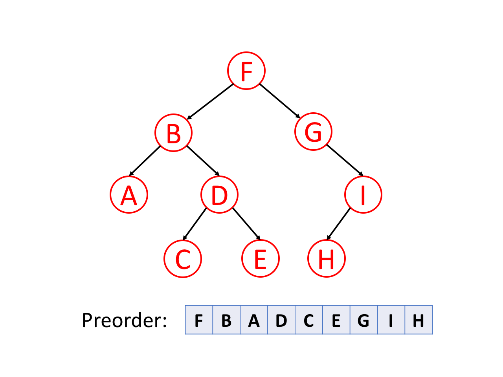

## Binary Trees

**Pre-Order Traversal (DFS)**
- Root node is traversed first. Then the left subtree, and then the right subtree.

---

**In-Order Traversal (DFS)**
- Left subtree is traversed first. Then the root node, and then the right subtree. 

---

**Post-Order Traversal (DFS)**
- Left subtree is traversed first, Then the right subtree, and then the root node. 

---

**Level-Order Traversal (BFS)**
- Used in Breadth-First Search. 
- Traversal is by levels, and the return type is a list of lists, where each inner-list is the corresponding level traversal values. 

