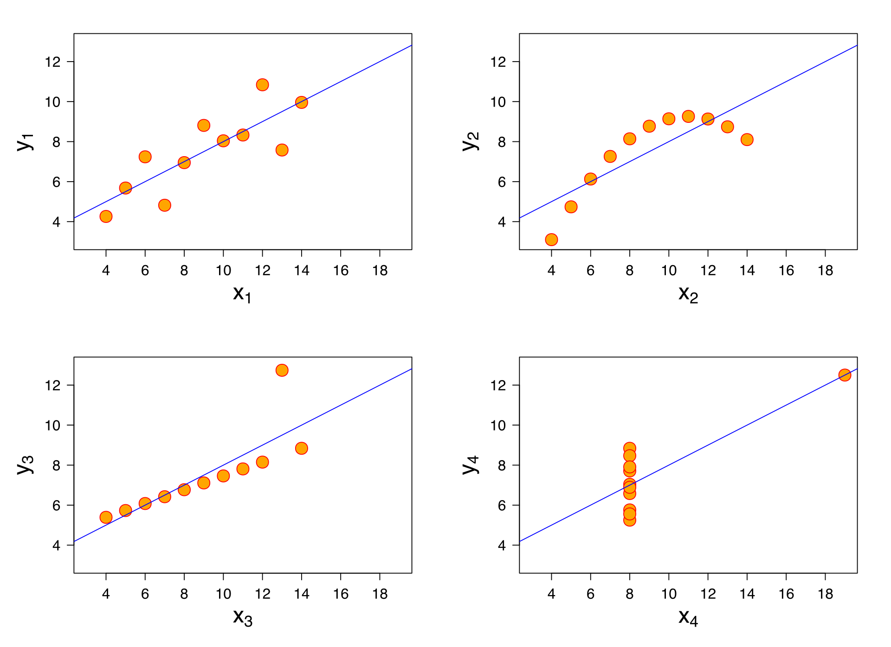

## Linear Regression

### Outliers
LR can be significantly affected by outliers, as shown by the [Anscombe's Quartet](https://en.wikipedia.org/wiki/Anscombe%27s_quartet), where the following summary statistics are all same for the four cases: mean, variance of both $(x,y)$, correlation, LR parameters, and the coefficient of determination $R^2$. 
- *Pearson's Correlation Coefficient*: $corr(X, Y) = \frac{cov(X, Y)}{\sigma_X\sigma_Y}$. 
- *Coefficient of Determination*: $R^2 = 1 - \frac{SS_{res}}{SS_{tot}}$, where $SS_{res}$ is the residual sum of squares, and $SS_{tot}$ is the total sum of squares. $R^2$ determines the goodness of fit of a model. 

Outliers can be dealt with the following methods:
- Dropping the outliers (using either manual limits or the Winsorize percentile clipping or using Quartile limits), with the risk of losing possibly important information.  
- Log transformation, when dataset is skewed. The result is normally distributed data. 

### LR Assumptions
1. *Linearity* between predictors and response. 
    - Why it can happen? No linear relationship exists. 
    - What it will affect? Causes model underfitting. 
    - How to detect? For one predictor, use scatter plot between predictor and response. Otherwise, use scatter plot between response and predicted values - the points should lie on the diagonal. 
    - How to fix? Adding polynomial terms to some of the predictors, or applying nonlinear transformations, or adding additional variables. 
2. *Residual Normality*
   - Why it can happen? If the predictors or response is significantly non-normal, or because of outliers, or because the linearity assumption is violated. 
   - What it will affect? Can result in shrinking or inflating our confidence intervals. 
   - How to detect? Test for normality (such as Kolmogorov-Smirnov test) on the residuals. 
   - How to fix it? Nonlinear transformations, removing outliers, or excluding specific variables (such as with long-tailed distributions). 
3. *No Predictor Multicollinearity*
   - Why it can happen? Natural dependency amongst predictors, or by adding a predictor which is a linear combination of other features. 
   - What it will affect? Incorrect interpretation of the model parameters. 
   - How to detect? Predictor correlation matrix visualized as a heatmap, and by using the [*Variance Inflation Factor (VIF)*](https://en.wikipedia.org/wiki/Variance_inflation_factor) metric. 
   - How to fix it? Removing predictors which are highly correlated, or by performing dimensionality reduction. 
4. *No Autocorrelation of Residuals* or independence of errors.
   - Why it can happen? Usually for time-series data, when there is some information from the past that we are not capturing, or due to violation of the linearity assumption. 
   - What it will affect? Will impact model estimates. 
   - How to detect? Plot of residual autocorrelations. 
   - How to fix it? Adding lag variables for time-series datasets, or adding additional transformations. 
5. *Constant Variance for Residuals*, also called Homoscedasticity. 
   - Why it can happen? Natural high variance of predictors for higher values, or the model is overfitted to a subset of the data where there is high residual variance. 
   - What it will affect? Significance tests for model parameters due to the standard errors being biased. Too narrow or too wide confidence intervals. 
   - How to detect? Plot the residuals. 
   - How to fix it? Log-transforming the predictors, or using Bayesian LR where the variance is assumed to be the function of the mean. 