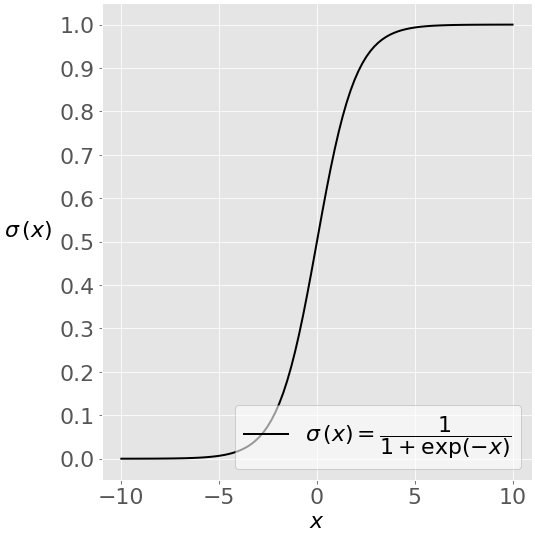
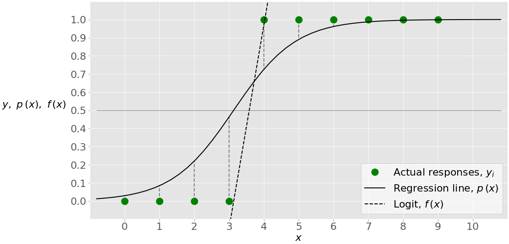

## Logistic Regression
**Pre-Requisites**
- Sigmoid Function: $\sigma(x) = \frac{1}{1 + e^{-x}}$. 

**Training**
- For each observation $i$, let $y_i$ be the actual output label (either 0 or 1), and let $\bf{x}_i$ be the feature vector. 
- Logit is the linear classifier $f(x) = b_0 + b_1x_1 + ... + b_rx_r$, where the aim is to estimate the coefficients. 
- Logistic regression function is $p(x) = \sigma(f(x))$. 
  - Also called the probability of classification. 
- We maximize the Log-Likelihood function: $\sum_i (y_i\log(p(x_i)) + (1-y_i)\log(1-p(x_i)))$. 
  - When $y_i=1$, LLF max (0) is when $p(x_i)\rightarrow 0$. If $p(x_i)$ is far from 0, LLF is a large negative number. 
- Use gradient descent to minimize LLF. 

**Inference**
- Once the coefficients are estimated by maximizing LLF, for a given observation $x$, we can easily calculate the regression line $f(x)$ and then the logistic regression function $p(x)$. 
- Usually, when $p(x)<0.5$, then $y_p=0$, and when $p(x)>=0.5$ then $y_p=1$. 
- Single variate logistic regression is depicted as:

**Regularization**
- $L_1$: penalizes the LLF with the scaled sum of the absolute values of the coefficients/weights: $|b_0|+|b_1|+...+|b_r|$. 
- $L_2$: penalizes the LLF with the scaled sum of the squared of weights: $b_0^2 + b_1^2 + ... + b_r^2$. 
- Elastic-net: linear combination of $L_1$ and $L_2$ regularization. 

**Advantages**
- Easy to implement, interpret and efficient to train. 
- No assumptions on distributions of classes in feature space. 
- No assumptions on residuals. 
- Can easily extend to multiple classes. 

**Disadvantages**
- If number of observations is less than the number of features, logistic regression should not be used; otherwise leads to overfitting. 
- Assumption of no multicollinearity between predictors. 

### Assumptions:
1. Linear relationship between the logit of the outcome and predictors. Logit function: $logit(p) = \log(\frac{p}{1-p})$. 
   - Can be checked by plotting each predictor and the logit values. 
2. No multicollinearity between predictors. 
3. No influential outliers. 
4. Observations are independent of each other. 