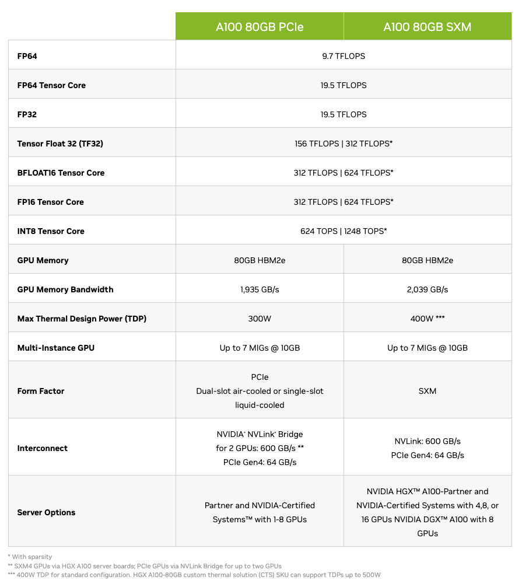
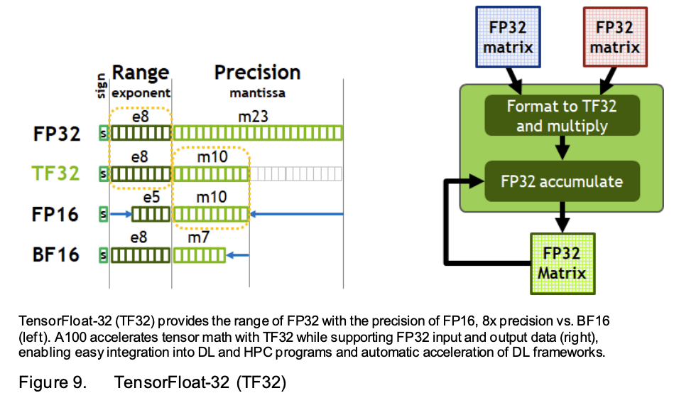

## (NVIDIA) GPU Optimization
- We always want to start with what hardware we have.
    - Let's say we have 8x A100 SX4M 80GB GPUs ([Reference](https://www.nvidia.com/en-us/data-center/a100/))
- By default, everything in pytorch is float32 precision.
    - I.E., every weight is using a representation that has 32-bits (4 bytes).
    - Deep learning networks can tolerate significantly lower precision.
- A100 SX4M 80GB Performance:
    - FP32 --> (at most) 19.5 TFLOPS; i.e., we can do at most 19.5 trillion floating point operations per second. 
    - However, as we see from the table, if we go down in specs (TF32, FP16), we can get significant higher performance.
    - Sparsity-based computations (specs marked with an *) are not widely used.
- A100 SX4M 80GB Memory:
    - Most of the deep learning workflows are *memory-bound*, i.e., the tensor cores during these fast computations (TFLOPS) are just waiting around idle because we can't feed/load them with data fast enough (memory bandwidth).
    - In terms of GPU utilization, if you're using 60% then you're doing extremely well.
- When we use less performance precision, using less memory is an added benefit.
- Calculate **tokens/sec** in the training loop as the objective measure for optimization speedup. 

### TensorCores
- TensorCore: An 'instruction' in the A100s, which is basically a 4x4 multiplier of matrices with different precisions.
- Any time we have matrix multiplication in our computations (which is most of the time with deep learning), it gets broken up into the 4x4 mutipliers. This accelerates the overal computations.
- The TensorCore instruction for TF32 allows truncating the *mantissa* part of the 32-bits representation of floating point numbers (32 --> 19).
    - This gives us the speedup and memoy savings, however with some approximations (usually not noticeable).
    - Since the input/output is still FP32, nothing changes in the code. The truncation is done internally with the instruction. 

### Optimization #1: `torch.set_float32_matmul_precision("high")`
- [Reference](https://pytorch.org/docs/stable/generated/torch.set_float32_matmul_precision.html)
- Cropping of mantissa bits so that the actual multiplication happens with truncated bits (TF32).
- Can result in at most 8x faster computations, albeit bottlenecked by memory bandwidth.
    - We are shoveling around float32s all over between CPU-GPU and within GPU, which is causing the bottleneck. 
    - Also going from FP32 to TF32 only saves compute time due to lower precision; the memory requirements still stay the same since TF32 also occupies 32 bits in memory. 
- Might not be available on older GPUs (available on A100-series). 

### Optimization #2: `torch.autocast(dtype=torch.bfloat16)`
- Dropping down precision to BF16: even more aggressive with mantissa bits than TF32.
- Float numbers:
    - Range: The *Exponent* sets the range of the numbers.
    - Precision: The *Mantissa* determines how many possibilities we have within that range to represent numbers.
- FP16 hence cannot represent the full range of numbers which can cause issues. *Gradient Scalers* have to be then used to compensate.
- BF16, however, does change the numbers/tensors more significantly than TF32. We can use [mixed precision](https://pytorch.org/tutorials/recipes/recipes/amp_recipe.html#adding-torch-autocast) to let pytorch decide when to use BF16.
    - Do not cast with `bfloat16()` manually when using `autocast()` (unlike with Optimization #1). 
    - Should be used in the forward pass of the model, and the loss calculation.
    - Should not be used in the backward and optimizer step.
- Using `autocast()`, our model weights will still remain in float32, but our logits will be in BF16 (mixed precision). 

### Optimization #3: `torch.compile()`
- JIT compilation: Speedup mainly comes from:
    - *Reducing python overhead*: Analyze the code and avoid *eager mode* of sequential python interpreter. Runs in efficient code and does not use python interpreter.  
    - *GPU read/writes*: Looking ahead in operations and avoiding needless data transfer between GPU cores and HBM (High Bandwidth Memory: GPU memory/RAM). E.g. [estimated GELU with `tanh`](https://pytorch.org/docs/stable/generated/torch.nn.GELU.html). Within the GPU core (which internally has a very small amount of memory) everything is very fast; roundtrip to HBM takes significant time. Example of **kernel fusion**. 
- Will cost initial compilation time but results in significant speedup. 

### Optimization #4: `Flash Attention`
- [Reference Paper](https://arxiv.org/pdf/2205.14135)
- There are operations which `torch.compile()` cannot find, e.g. the attention operation.
- FlashAttention is an algorithm for fast computation of attention operation.
    - Algorithmic re-write of the attention operation. 
    - *Kernel fusion* operation: Combines the Query-Key dot product, Masked fill kernel trick, Softmax, and Value dot product.
    - Hence, the attention matrix is not computed/materialized explicitly.
- Very mindful of memory hierarchies, and minimzes read/writes to HBM.
- *Interesting Fact*: The fundamental technique which FlashAttention is based on, is taken from [NVIDIA's 2018 Paper](https://arxiv.org/pdf/1805.02867). However, NVIDIA never implemented it for their GPUs before FlashAttention was released by Stanford in 2022.
- Used with `F.scaled_dot_product_attention()` in pytorch. 

### Optimization #5: `Remove Ugly Numbers`
- Use powers of 2 everywhere in the code where there are hardcoded hyperparameters.
    - Even numbers are also nice.
    - Odd, especially prime numbers, are ugly.
- This is because in CUDA and elsewhere there are block of powers of 2 for processing. Anything which falls outside these blocks is handled by special kernels which have to spun up, which in turn costs latency.
- One change is increasing the vocab size to a nice number.
    - This will introduce dummy tokens which will not be used and their probabilities driven to zero.
    - Not any different from other tokens in our data that are never used. 

### Optimization #6: `GPT-3 Hyperparameters`
- [Paper Reference](https://d4mucfpksywv.cloudfront.net/better-language-models/language_models_are_unsupervised_multitask_learners.pdf)
- *Adam* hyperparameters.
- *Clipping the global norm*: After `loss.backward()` at each time step, we clip the gradients vector to have a maximum norm.
    - If/when encountering an "unlucky" batch, we can get very high loss which in turn would lead to very high gradients. Clipping the global norm of the gradient vector avoids this situation.
    - Should visualize the gradient norm during training.
- *Learning rate scheduler*:
    - Initial warmup till some amount of samples, 
    - Cosine decay to a minimum value
- *Gradual batch size increase*:
    - This is done because initially the learning is focused on more simple rules: ignoring certain tokens, etc. For these we don't need a huge batch size.
- *Data sampled without replacement*
- *Weight decay*: Provides regularization.
- *Large batch size*:
    - GPT-3 uses 0.5M batch size in the number of tokens, which is equivalent to `B=488` in our implementation (since our batch size is a `T` row of tokens with `T=1024`). However we are using `B=16` because of compute limitations.
    - We still want to use the large batch size, especially since it is correlated with other hyperparameters.
    - We use *Gradient Accumulation* for this.
- *Gradient Accumulation*:
    - Execute the forward pass several times until we reach the 0.5M batch-size, in each iteration.
    - `loss.backward()` will accumulate gradients. 
- *Distributed training*:
    - `torch.nn.parallel.DistributedDataParallel()` (DDP)
    - Train on several GPUs. 
    - *Map*: Each process on each GPU will be working on different parts of the data.
    - *Reduce*: Subsequently, averaging of gradients is done from all GPUs at each backward pass step.
          - We only want the averaging of gradients at the very last step for gradient accumulation. 

## Datasets
- GPT2 dataset:
    - Webtext: Never released; Reddit outbound links with 3+ karma, resulting in 40GB of text. 
    - [OpenWebText](https://skylion007.github.io/OpenWebTextCorpus/): Attempt at recreating it.
- GPT3 dataset:
    - Common Crawl: Very noisy (random subset of the internet) so have to be filtered/cleaned.
    - Hence, GPT3 uses *data mixtures*: curated dataset from various sources. GPT3 never released this data mixture.
- *RedPajama / SlimPajama* are also popular data mixtures.
- [*FineWeb*](https://huggingface.co/datasets/HuggingFaceFW/fineweb) dataset: Curated Common Crawl with 15T tokens (44TB disk space)
    - [*FineWeb-Edu*](https://huggingface.co/datasets/HuggingFaceFW/fineweb-edu): High-educational subset of FineWeb with 1.3T tokens. We will use the randomly sampled **sample-10BT** subset (10B tokens). Suffices to get close to GPT2 performance. 