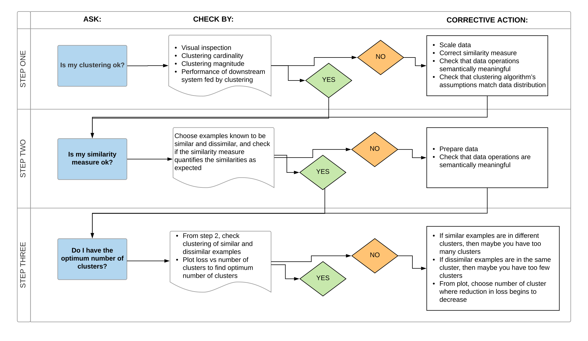

## Similarity Measures
- *Jaccard Similarity*
  - Similarity between two sets.
  - Jaccard index/distance: $0 \leq J(A, B) \leq 1$. 
  - Used when only Binary (e.g. purchased/not purchased) unary (item transactions) data is present. 
  - Sets $A, B$ can be the sets of user-purchases for two different items; the Jaccard index will give us the similarity between these items. 

$$J(A, B) = \frac{|A\cap B|}{|A\cup B|} = \frac{\# \text{users who purchased both items}}{\# \text{users who purchased either item}}$$

- *Norms*
  - $L_1$-norm:
    - $L_1(A, B) = \sum_i|R_{A,i} - R_{B,i}|$, where $A, B$ are users, and $R_{A,i}, R_{B,i}$ are user-ratings. Also called Manhattan distance. 
    - *Mean Absolute Error (MAE)* = $\frac{1}{n}L_1(A,B)$. 
  - $L_2$-norm:
    - $L_2(A,B) = \sqrt{\sum_i|R_{A,i}-R_{B,i}|^2}$. Also called Euclidean norm. 
    - *Root Mean Squared Error (RMSE)* = $\frac{1}{n}L_2^2(A,B)$. 

- *Cosine Similarity*
  - $CosSim(i, j) = \frac{R_i.R_j}{||R_i||_2||R_j||_2}$, where $R_i$ is the rating column for the $i^{th}$ item. 
  - To adjust for user biases, $R_i \leftarrow R_i - \bar{R_i}$, where $\bar{R_i}$ is the user's average rating. 
  - If a user has not rated an item, use 0 in the calculations. 

- *Pearson Similarity*
  - Similar to adjusted Cosine similarity, however, use only item that have been rated. 

- **Important points:**
  - pass

## Clustering
- *K-Means Clustering*
  - It's a good idea to first divide the data into smaller groups, so we only need to calculate similarity between groups with fewer users. 
    - Groups can be created ad-hoc with domain knowledge, or
    - Using unsupervised learning methods for clustering such as K-Means. 
  - For a new user entering the system:
    - First identify which cluster the user is a part of, 
    - Calculate similarities against other users in the cluster. 
  - Algorithm:
    - Sensitive to initial conditions. 
    - Steps:
      - Randomly choose $k$ points in the data as centroids. 
      - Calculate distance of these centroids from all other data points. 
      - All data points are assigned an initial cluster based on which is the closest centroid. 
      - For each cluster, compute the average - this will be the new cluster centroid. 
      - Re-assign points to centroids based on which one is closest. 
      - Re-compute the average to get new centroids. 
      - Keep track of distance between changing centroids to check stopping criteria. 
  - Results metrics to check:
    - Cluster cardinality: Number of examples per cluster; check for outliers. 
    - Cluster magnitude: Sum of distances from all examples to the centroid of the cluster; check for anomalies. 
    - Magnitude vs. Cardinality: Plot both together; higher cluster cardinality should result in a higher cluster magnitude (linear correlation). 
    - Performance of downstream systems when changes are done to:
      - Similarity measure: Sanity check with known dissimilar/similar examples. 
      - Number of clusters: Grid search and look for a knee-plot. 
  - Advantages:
    - Simple to implement, 
    - Scales to large datasets, 
    - Guaranteed convergence, 
    - Can warm-start the positions of centroids, 
    - Easily adapts to new examples, 
  - Disadvantages:
    - Choosing $k$ manually, 
    - Dependent and sensitive to initial values
      - Can use K-Means++ algorithm to optimally choose the initial values for $k$ clusters. 
    - Clustering outliers, 
    - Does not do well with high-dimensional data when using distance-based similarity measures. 
      - This is because as dimensions increase, the distances tend to converge (curse of dimensionality). 
      - To avoid this, use dimensionality reduction with PCA, or use spectral clustering methods to first project the features to a lower dimensional space. 
  
    
