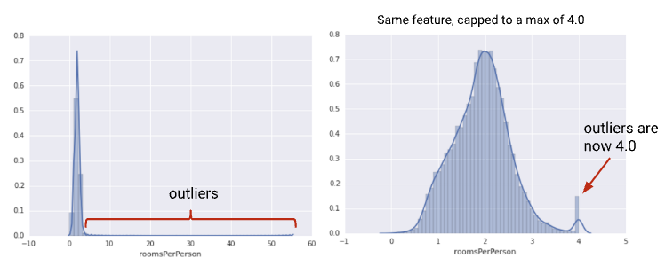
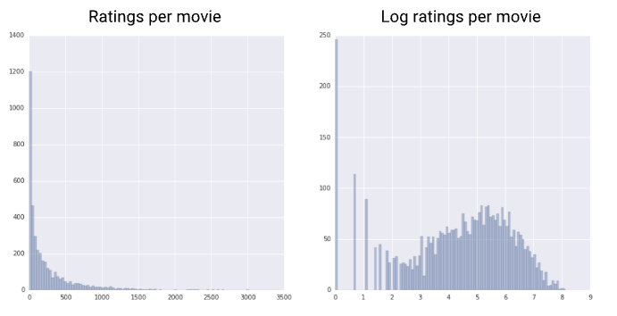
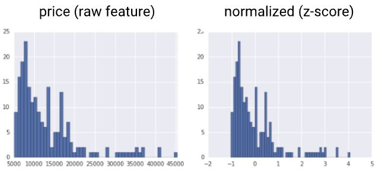

## Feature Scaling

| Normalization Technique | Formula                                             | When to Use                                                                                                                   | Data Example |
|-------------------------|-----------------------------------------------------|-------------------------------------------------------------------------------------------------------------------------------|--------------|
| Linear Scaling          | $x' = \frac{x-x_{min}}{x_{max}-x_{min}}$            | Feature is approx uniformly distributed across a fixed range                                                                  |        |
| Clipping                | $x' = max$ if $x > max$.  $x' = min$ if $x < min$.  | Feature contains some extreme outliers.                                                                                       | figure 1       |
| Log Scaling             | $x' = \log(x)$                                      | Feature conforms to the Power Law (i.e., when a handful of values have many points, while most other values have few points.) | figure 2      |
| Z-Score                 | $x' = \frac{x - \mu(x)}{\sigma{(x)}}$                 | Feature distribution does not contain extreme outliers, and ensuring that the feature distributions have 0 mean and 1 std.                                                                        | figure 3      |

### Examples of Data Distributions
- **Figure 1: Clipping**

- **Figure 2: Log Scaling**

- **Figure 3: Z-Score**

