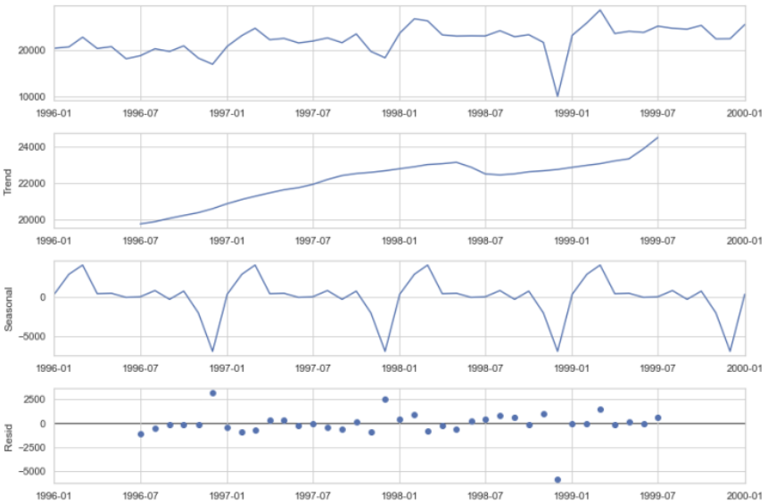

# Time-Series Modeling

## Stationarity
Stochastic process for which the mean and variance do not change over time. In time-series analysis, non-stationary data is often transformed to become stationary. An example is white noise. 
- If we draw a line through the middle of a stationary process, it should be flat. 
- It may have seasonal cycles, but overall it does not trend up or down. 

Types:
- *Weak-Sense Stationarity*: Only require that the mean and autocovariance do not vary w.r.t time, and that the variance is finite. 
  - Autocovariance: Covariance of the process with itself at pairs of time points. 
    - Covariance: Joint variability of two random variables. $cov(X, Y) = E[(X-E[X])(Y-E[Y])]$. 

## AR Model
Autoregressive Model: Random process such that the output variables depend linearly on its own previous values and on a stochastic term. An AR($p$) model is written as:

$$X_t = \sum_{i=1}^p\alpha_iX_{t-i} + \epsilon_t$$

Process is not always stationary. 

## MA Model
Moving Average Model: Output variables are correlated with historical white noise. An MA($q$), with $\mu$ as the series mean, is written as:

$$X_t = \mu + \sum_{i=1}^q\beta_i\epsilon_{t-i} + \epsilon_t$$

Process is always stationary. 

## ARMA Model
Process output in terms of two variables: one for AR and other for MA. Used as a tool for understanding and predicting future values in the series. An ARMA($p,q$) is written as:

$$X_t = \epsilon_t + \sum_{i=1}^p\alpha_iX_{t-i} + \sum_{i=1}^q\beta_i\epsilon_{t-i}$$

Process is a weak-sense stationary process. 

## ARIMA Model
Autoregressive Integrated Moving Average Model: Generalization of ARMA model, used when the data shows evidence of non-stationarity in the sense of mean but not variance. The differencing step (corresponding to the *Integrated* part) can be applied multiple times to get rid of the mean non-stationarity, before using the ARMA model. Differencing step (random walk):

$$X_t = X_{t-1} - \epsilon_t$$

Represented by ARIMA($p,d,q$). 

## Feature Extraction
Time-Series can be decomposed into various components:
- Trend: Increasing or decreasing. 
- Seasonality: Periodical patterns repeating at a constant frequency. 
- Residual: After extracting Trend and Seasonality; helps in anomaly detection. 
- Cycle: When there are Trends with no set repetitions or seasonality. 
- Stationarity: Constant mean and variance. 

## Comparison with Linear Regression
Time-Series (TS) models: The AR part of ARIMA model is *auto-regressive*, i.e. trying to estimate future values given past data. The MA part just means there is a component with unobserved error terms.

### Common Characteristics
- Require stationarity
  - For LR, residuals need to be stationary. Hence, the predictors (if time-series) should also be stationary. If non-stationary, transform the predictors. 
  - For TS, the past values need to be stationary. If non-stationary, we do difference step(s) to achieve stationarity. 
- Linear models in terms of coefficients
- High correlation between the response variable and the dependent variables. 
- Methods to estimate coefficients are similar: finding slope and intercept. 
- Use statistical tests to evaluate the quality of the fit. 

### Different Characteristics
- LR: No natural ordering to the observations, i.e. not time-series. 
- LR: Uses two different variables: one for response, and one for predictor. TS is auto-regressive, hence only one variable lagged in time.
  - LR: Emphasizes that one variable (response) depend on the other (predictors). 
