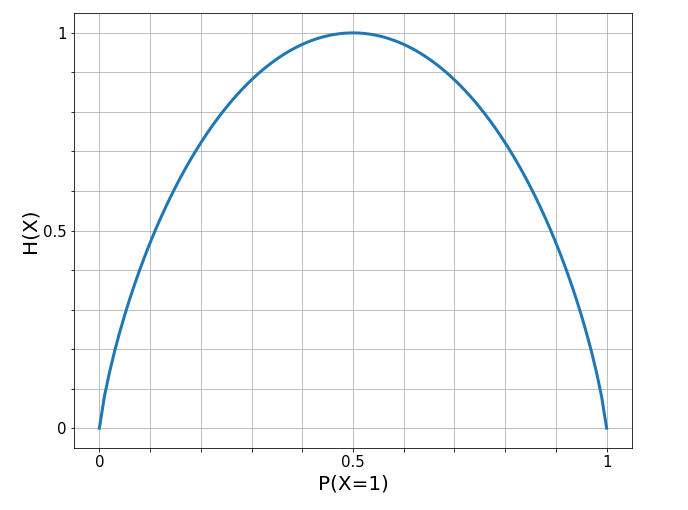

## Decision Trees
Needs a lot of depth to gain predictive power. 
  - Binary trees can have size up to $2^{d+1} - 1$ where $d$ is the tree depth. 
  - Leads to a lot of complexity which leads to low bias, high variance. 

### Entropy
- Measurement of uncertainty; sometimes called *impurity*. 

$$H(X) = -\sum_{j}p_j\log p_j$$

- For binary classifications: $H(X) = -p\log_2p - (1-p)\log_2(1-p)$, where $p$ denotes $P(X=1)$ for an event $X$. 
- Intuitive interpretation:
  - *Certainty*: Entropy is maximized when all samples (in a node) belong to the same class such that $P(X=1)=1$. 
    - $-1.\log_2(1) - 0.\log_2(0) = 0$
  - *Uncertainty*: Entropy is minimized when we have a uniform class distribution such that $P(X=1)=0.5$ (binary classification). 
    - $-0.5.\log_2(0.5) - 0.5.\log_2(0.5) = 0.5 + 0.5 = 1$

- Conclusions:
  - When looking for a training set to split, we should aim to **maximize** entropy. 
  - When we are looking for a value to split (in a decision tree), we should aim to **minimize** entropy. 

### Information Gain
- Comparing the entropy before and after a split, we get *Information Gain*. 
  - Measures how much information was gained when splitting a node at a particular value. 

$$IG(D) = I(D_p) - (\alpha_lI(D_{left}) + \alpha_rI(D_{right}))$$

- where 
  - $D_p, D_{left}, D_{right}$ represent the datasets from the parent, and left and right children nodes, 
  - $\alpha_l = \frac{N_{left}}{N_p}$ and $\alpha_r = \frac{N_{right}}{N_p}$ are the scaling factors with $N_p, N_{left}, N_{right}$ as the number of samples in the parent, left and right children nodes, respectively. 
- Constructing a tree:
  - At a node, we would want to maximize $IG(D)$, across all possible splits. 
  - Repeat this process for every node until we reach a terminal node that  consists of one class only (min. entropy) or when we reach a pre-specified max. depth. 
  - The class with the highest counts in a terminal node (*leaf*) will be assigned to any test value that lands on that terminal. 

### Bootstrapping
- For each tree, selecting $n$ samples (from a dataset with $n$ observations) with replacement. 
  - This will leave out approximately one-third of observations in each distinct tree. 
- Out-Of-Bag (OOB) error estimate:
  - With *Random Forests* bootstrapping, using OOB error estimates, we get cross-validation for free. 
  - OOB samples are those one-third samples that were not selected to build the particular tree. 
  - These OOB samples are used for evaluating the tree after training to generate a prediction error. 
  - Error for all trees are averaged to get the mean prediction error for random forests. 
  - Hence cross-validation is done without having to specifically to do. 

### Bagging
- Bagging is the process of growing a tree where each node in the tree looks at **every** value in our bootstrapped sample in **every** feature to find the best split in the data at that particular node. 
  - Repeated for all trees. 
- With *Random Forests*, a tree will only look at a subset of features $m = \sqrt{p}$, where $p$ is the total number of features. 
  - Injects even more randomness into the model which captures more variability among features. 

## Random Forests
No assumptions. 
- Handles missing values and outliers very well. 
- Does not make a lot of assumptions on the underlying dataset. 
- Overfitting is taken care of with bagging. 
- Feature importance is less interpretable. 

## Isolation Forests
- Built around the theory of decision trees and random forests, and used for anomaly detection. 
- Unsupervised ML algorithm. 
- The algorithm splits the data in two parts using a random threshold. 
  - This process continues until each data point is isolated. 
  - Once the algorithm runs through all data points, it filters the data points which took fewer steps than others to be isolated. 
- The model returns the anomaly score of each instance to measure abnormality. 