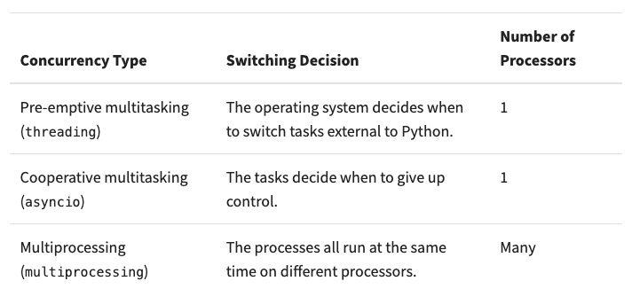
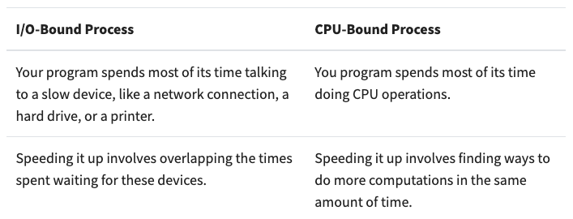

**Important Points** [[Article](https://realpython.com/python-concurrency/)]:
- *Definition*: Ability to execute concurrent units of a program parallely or out-of-order to significantly improve the speed of execution. 
- Three broad methods:
  - Threading
  - AsyncIO
  - Multiprocessing
- Two broad problem scenarios:
  - I/O-Bound process
  - CPU-Bound process

---

---

**Threading**
- Runs on a single processor, hence threads only run one at a time.  
  - Hence not great for cpu-bound processes since little speedup (or even negative) will be achieved. 
- OS is in charge of switching tasks, hence called *co-operating multitasking*. 
- Code is easier to write since the user is not in charge of managing task switching.
- Experimentation is required for deciding number of threads to be used.  
- Race conditions can happen which can be hard to detect and debug. Thread locking mechanisms can be used to prevent thread interference. 
  - Any data that is shared between the threads also needs to be protected, in other words be *thread-safe*. 
- Python: `ThreadPoolExecutor`:
  - `Thread` + `Pool` + `Executor`
  -  Creates a `Pool` of `Threads`, each of which run concurrently. 
  -  `Executor` controls how and when each of the threads in the pool will run, executing the requests in the pool. 

---

**AsyncIO**
- Runs on a single processor; most suitable for i/o bound programs. 
- The *Event loop* is in charge of switching tasks, which is managed by the user. 
- Once triggered to run by the event loop, a task will never give up control without intentionally doing so. It can give up control in cases of exception, completeness, etc. Once the task gives up control, then it's the event loop's job to trigger the next task from a queue. 
- Code is more complex to write since task management is user's responsibility. Hence also this can lead to significant issues because of a small human mistake. 
- Python:
  - Any function implementing `asyncio` needs to have the keyword `async` before `def`. 

---

**Multiprocessing**
- Runs on multiple processors; most suitable for cpu-bound programs. 
  - Threading and `asyncio` run on a single processor due to the *Global Interpreter Lock ([GIL](https://realpython.com/python-gil/))*. 
- Utilizes all logical processors in the system (single core can have multiple logical processors - can be checked with Task Manager). 
- The program needs to be divided such that it can be run parallely. 

---

**When to use Concurrency**
- Concurrency comes with extra complexity. 
- Concurrency should be considered when there are performance issues with the current architecture. 
- For i/o bound programs, consider threading or asyncio. 
- For cpu-bound programs, consider multiprocessing. 